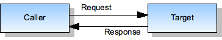
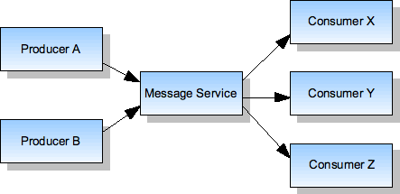
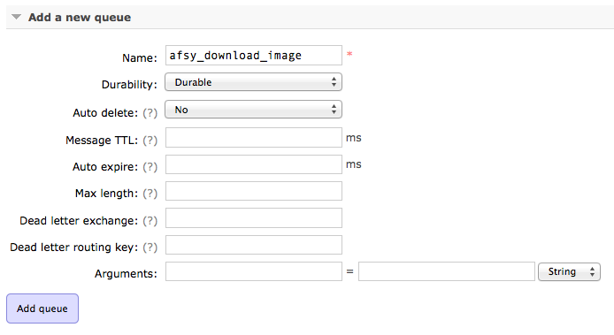
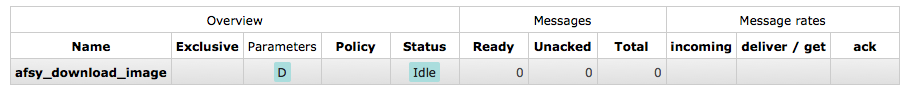
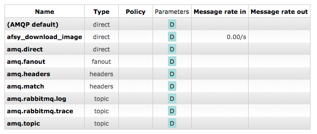
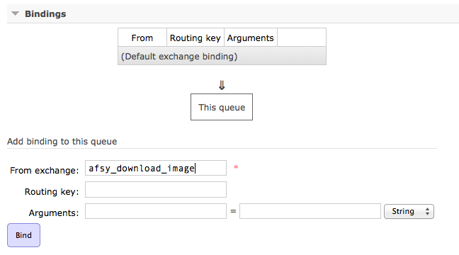
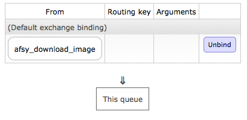
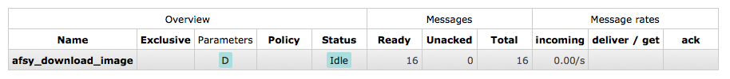
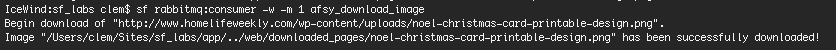

# RabbitMQ et Symfony2 : how to make asynchronous scripts and manage queues

PHP is often said to be too limited, and moreover talking about heavy scripts and asychronism. When you need, for example, to execute some action on 10.000 elements, it became a bit complicated and takes a lot of server ressources… unless you use a queues manager.

That's why I'll present you a messaging system that implements the [AMQP](http://en.wikipedia.org/wiki/Advanced_Message_Queuing_Protocol) : [RabbitMQ](http://www.rabbitmq.com/), and its Symfony2 bundle [RabbitMQBundle](https://github.com/videlalvaro/rabbitmqbundle), developed by [Alvaro Videla](https://github.com/videlalvaro).

## A messaging system?

After using different API in different environments, a messaging protocol has been created by the [JPMorgan Chase](http://fr.wikipedia.org/wiki/JPMorgan_Chase) bank for more easily exchanges between systems. Instead of a specific protocol for each exchange, we use a "messaging system" to dispatch messages automatically. And instead of making "direct" exchanges, each system can send one or multiple messages to a given service and a lot of systems can subscribe to get these messages.

### Producers, consumers… what ?

In a messaging system, the process to send messages to an agent (`broker`) is called a **producer**, and the one who receive messages is called the **consumer**. In fact, all goes from the producer to the consumer… as in real life :)

### A few explanations in images

All this looks confusing? Here are 2 images to see it more clearly:



We have a simple system with a caller and a target, but no more interactions.



Here is a more complexe system where, with a messaging service, a producer B can communicate directly with 3 consumers called X, Y and Z. (source: [Inspirel](http://www.inspirel.com/yami4/book/4-1.html)).

## Install and requirements

### RabbitMQ Install 

So, here we go. Firstly, we need to install [RabbitMQ](http://www.rabbitmq.com/), and, I assure you before you'll ask, it is available for [Linux](http://www.rabbitmq.com/install-debian.html), [Mac](http://www.rabbitmq.com/install-standalone-mac.html) and [Windows](http://www.rabbitmq.com/install-windows.html). 

One installed, you only need to launch the server with this command:

```
$ rabbitmq-server -detached
```

Then, launch your favorite browser and go to [http://localhost:15672/](http://localhost:15672/) to see your brand new messaging system (empty for the moment). By default, you can access with the guest account (`guest`/`guest`), but you could manage different users.

That's it, we have a messaging system ready to make asynchronous processing.

### Creation of an AfsyTutorialBundle bundle

For this example, we will create a bundle named `Afsy/Bundle/TutorialBundle` with the Symfony command line (with YML as configuration format and generation of the whole structure).

```
$ cd /path/to/afsy/project
$ php app/console generate:bundle
```

For simplicity reasons, we will use the YML format for the routing, but the XML format for the services.
Then, we will create `Component` and `Component/AMQP` folders in the `Afsy` folder, in order to declare all the required components we will develop:

```
$ cd /src/Afsy
$ mkdir -p Component/AMQP 
```
It's in this folder that we will create the producer and consumer classes.

### RabbitMQBundle Install

Once our bundle ready, we will add the RabbitMQBundle bundle to the `composer.json` file:

``` json
{
    "require": {
        "oldsound/rabbitmq-bundle": "1.2.*",
    }
}
```

And do a composer update : 

```
$ composer update oldsound/rabbitmq-bundle
```

And finally, add it in the `app/AppKernel.php` file:

``` php
public function registerBundles()
{
    $bundles = array(
        new OldSound\RabbitMqBundle\OldSoundRabbitMqBundle(),
    );
}
```

### RabbitMQBundle Configuration

To configure this bundle, nothing difficult: we use the [bundle's default configuration](https://github.com/videlalvaro/rabbitmqbundle#usage) in the `app/config/config.yml`: 

```yaml
old_sound_rabbit_mq:
    connections:
        default:
            host:     'localhost'
            port:     5672
            user:     'guest'
            password: 'guest'
            vhost:    '/'
            lazy:     false
```

Here we go, we can use it.

## A piece of exerice

After theory (and install), let's do some practice. We will take a concrete example : a website hoover, or at least, a webpage hoover. Why? Because it's often good to download a webpage from a PHP application, and download its images in the same time.

### A last requirement

One last thing before beginning to develop this hoover… In this exercice, we will use the Curl class to "aspire" different webpages. But to do this easily, it's better to download a Curl class, such as [this one](https://github.com/php-curl-class/php-curl-class) and to put it in the `Afsy/Component/Curl` folder, instead of making request by hand. The following scripts will only use the *get()* method of this class.

Then, we register this class as a service in the services.xml file (`src/Afsy/Bundle/TutorialBundle/Resources/config/services.xml`).

```xml
<service id="curl" class="Afsy\Component\Curl\Curl">
</service>
```

And that's good :)

### A basic hoover

Let's create a simple hoover class, named `PageHoover.php` and saved in the `/src/Afsy/Component/` folder:

```php

namespace Afsy\Component;

use Afsy\Component\Curl\Curl;
use Symfony\Component\DomCrawler\Crawler;

class PageHoover
{

    protected $curl = null;
    protected $options = array();
    protected $downloadFolder = null;

    /**
     *  Main constructor
     *  
     *  @param (Curl) $curl         Curl class
     *  @param (array) $options     Options list
     *
     *  @return (void)
     */
    public function __construct(Curl $curl, array $options)
    {
        // Initialize
        $this->curl = $curl;
        $this->options = $options;

        // Initialize options
        $this->downloadFolder = $options['downloadFolder'];
    }

    /**
     *  Download page method
     *
     *  @param (string) $page       Page to download (url)
     *
     *  @return (boolean) Download status
     */
    public function downloadPage($page)
    {
        // Initialize
        $pageParts = pathinfo($page);
        $saveFile = $this->downloadFolder.date('Ymd-His').'-'.$pageParts['filename'].'.htm';

        // Download page
        $pageContent = $this->curl->get($page); 
     
        // Check downloaded content
        if(!$pageContent) { return false; }

        // Save page in downloadFolder
        if(!file_put_contents($saveFile, "\xEF\xBB\xBF".$pageContent->body))
        {
            // Throw error
            throw new \Exception("Error saving file", 1);
        }

        // Initialize crawler
        $crawler = new Crawler($pageContent->body);

        // Get images list
        $images = $crawler->filter('img')->each(function($image, $i) { return $image->attr('src'); });

        // @todo : Download images

        // Return status
        return true;
    }
}
```

Then, we instanciate it as a service in the services.xml (`src/Afsy/Bundle/TutorialBundle/Resources/config/services.xml`) file:

```xml
<service id="afsy.pagehoover" class="Afsy\Component\PageHoover">
    <argument type="service" id="curl" />
    <argument type="collection">
        <argument key="downloadFolder">./downloaded_pages/</argument>
    </argument>
</service>
```

We'll take care, in the same time, to create the `/web/downloaded_pages/` folder to store the downloaded pages, and give it the right permissions (as a cache folder):
 
```
$ cd web/
$ mkdir downloaded_pages
$ chmod -R 777 downloaded_pages/
```

### Creation of the first action

In the default controller (`/src/Afsy/Bundle/TutorialBundle/Controller/DefaultController.php`), we will create a `downloadAction()` method:

```php
public function downloadAction()
{
    // Initialize
    $pageHoover = $this->container->get('afsy.pagehoover');

    // Download page
    $page = 'http://afsy.fr/';
    $pageHoover->downloadPage($page);

    // Return status
    $response = new Response();

    return $response->setContent('Page "'.$page.'" is downloaded !')->send();
}
```

And, of course, the related routing:

```yaml
afsy_tutorial_download:
    pattern:    "/afsy/download"
    defaults:   { _controller: "AfsyTutorialBundle:Default:download" }
```

## Let's dive

All this is nice, but for the moment, it's already known… I know, but it was required to explain you the principle more easily. And now, we can develop the images downloading part. Let's create our first producer.

### The first producer

The producer only need a few information: a few config lines… and that's all. 
So, let's update the old_sound_rabbit_mq configuration to declare it :

```yaml
old_sound_rabbit_mq:
    ...
    producers:
        afsy_download_image:
            connection:             default
            exchange_options:       { name: 'afsy_download_image', type: direct }
```

Then, we could use it as another service. Let's update the **PageHoover** service's configuration, adding this producer as a second argument:

```xml
    <argument type="service" id="old_sound_rabbit_mq.afsy_download_image_producer" />
```

You'll notice that the service name is really simple : **old_sound_rabbit_mq.[producer_name]_producer**.

Finally, we update the `PageHoover.php` class: 

```php

// We use the RabbitMqBundle producer
use OldSound\RabbitMqBundle\RabbitMq\Producer;

// We declare it as a protected variable 
protected $downloadImageProducer = null;

// And we update the constructor
public function __construct(Curl $curl, Producer $downloadImageProducer, array $[options)
{
    // […]
    $this->downloadImageProducer = $downloadImageProducer;
    // […]
}

// And finally, we update the *downloadPage()* method, replacing the '// @todo : Download images' part : 
// Download images
foreach ($images as $image) 
{
    // Initialize
    $image = str_replace(' ', '', $image);
    $imgExt = pathinfo($image, PATHINFO_EXTENSION);
    $hasHost = filter_var($image, FILTER_VALIDATE_URL, FILTER_FLAG_PATH_REQUIRED);

    // Check host
    if(!$hasHost) { $image = $pageParts['dirname'].$image; }

    // Check extension
    if(!in_array($imgExt, array('png', 'jpg', 'jpeg', 'gif'))){ $imgExt = 'png'; }

    // Create image to publish
    $imgToPublish = array
    (
        'url' => $image,
        'savePath' => $this->downloadFolder.pathinfo($image, PATHINFO_FILENAME).'.'.$imgExt,
        'savedHtmlFile' => $saveFile,
    );

    // Publish image
    $sImg = serialize($imgToPublish);
    $this->downloadImageProducer->publish($sImg);
}
```
Even if you'll already understand reading this code, here are a few explanations:

- After getting images list with the crawler, we make a loop on the urls to download
- We check image extension, and set one by default if not set
- We check too the host presence, and add it if not set
- And we create an array to be sent to the producer once serialized.

We could use JSON as exchange format, but the author of the RabbitMqBundle uses *serialize()*, so let's follow him.

#### Why serialization?

To easily pass an object (here our image to be downloaded) to the consumer, which will use it as a totally independent object. You don't have to forget the fact that, when the consumer will process this message, it won't have any information about its origin, neither what it should contains nor shouldn't contains. It will only know that it has to process it, that's all.

### The first consumer

Now, we need a receiver for this serialized object, and we'll create it with the AfsyDownloadImageConsumer class (`src/Afsy/Component/AMQP/AfsyDownloadImageConsumer.php`):
Instead of doing it in multiple steps, we'll create it as a single file with the given methods:

- *__construct()* to initialize curl and the different options
- *execute()* the main method to implement
- *downloadImageTo()* a method to download image into a given folder

```php

namespace Afsy\Component\AMQP;

use Afsy\Component\Curl\Curl;
use OldSound\RabbitMqBundle\RabbitMq\ConsumerInterface;
use PhpAmqpLib\Message\AMQPMessage;

class AfsyDownloadImageConsumer implements ConsumerInterface
{
    /**
     * @var Curl $curl
     */
    protected $curl;

    // Folders
    protected $createFolderMod = 0755;

    /**
     *  Main constructor
     *
     *  @param (Curl) $curl                 Curl
     *  @param (array) $options             Array of options
     *
     *  @return (void)
     */
    public function __construct(Curl $curl, $options = array())
    {
        // Initialize
        $this->curl = $curl;

        // Initialize options
        $this->createFolderMod = isset($options['createFolderMod']) ? $options['createFolderMod'] : $this->createFolderMod;
    }

    /**
     *  Main execute method
     *  Execute actions for a given message
     *
     *  @param (AMQPMessage) $msg       An instance of `PhpAmqpLib\Message\AMQPMessage` with the $msg->body being the data sent over RabbitMQ.
     *
     *  @return (boolean) Execution status (true if everything's of, false if message should be re-queued)
     */
    public function execute(AMQPMessage $msg)
    {
        // Initialize
        $imageToDownload = unserialize($msg->body);

        // Download image
        if(!$this->downloadImageTo($imageToDownload['url'], $imageToDownload['savePath']))
        {
            // Image should be downloaded again
            return false;
        }

        // Update saved html file
        $savedHtmlFileContent = file_get_contents($imageToDownload['savedHtmlFile']);

        // Update images paths
        $savedHtmlFileContent = str_replace($imageToDownload['url'], $imageToDownload['savePath'], $savedHtmlFileContent);

        // Save file
        return file_put_contents($imageToDownload['savedHtmlFile'], $savedHtmlFileContent);
    }

    /**
     *  Download an image to a given path
     * 
     *  @param (string) $downloadImagePath          Download image path 
     *  @param (string) $saveImagePath              Save image path
     * 
     *  @return (boolean) Download status (or true if file already exists)
     */
    protected function downloadImageTo($downloadImagePath, $saveImagePath)
    {
        // Initialize
        $saveImageFolder = pathinfo($saveImagePath, PATHINFO_DIRNAME);
        $saveStatus = false;

        // Check if image already exists
        if(file_exists($saveImagePath)) 
        { 
            echo 'File "'.$saveImagePath.'" already exists'."\n";
            return true; 
        }
        
        // Check if folder already exists
        if(!is_dir($saveImageFolder))
        {
            // Initialize
            $createFolderMod = is_int($this->createFolderMod) ? $this->createFolderMod : intval($this->createFolderMod);

            // Create folder
            mkdir($saveImageFolder, $createFolderMod, true);
            echo 'Folder "'.$saveImageFolder.'" has been created.'."\n";
        }

        // Download image
        try 
        {
            // Log download status
            echo 'Begin download of "'.$downloadImagePath.'".'."\n";

            // Get image content 
            $imageContent = $this->curl->get($downloadImagePath);

            // Check content
            if(!$imageContent || $imageContent->headers['Status-Code'] == '404') 
            {
                throw new \Exception('Error downloading file "'.$downloadImagePath.'" : returns a void content or a 404 page.', 1);
                return false;
            }

            // Save image 
            $saveStatus = file_put_contents($saveImagePath, $imageContent);
        
            // Log info
            echo 'Image "'.$saveImagePath.'" has been successfully downloaded!'."\n";

        } 
        catch (\Exception $e) 
        {
            // Log error
            echo '#ERROR# Image "'.$downloadImagePath.'" was not downloaded! '."\n";
        }

        // Return save status
        return $saveStatus;
    }
}
```

Then, let's add it in the available services:

```xml
<service id="afsy_download_image_service" class="Afsy\Component\AMQP\AfsyDownloadImageConsumer">
    <argument type="service" id="curl" />
    <argument type="collection">
        <argument key="createFolderMod">0755</argument>
    </argument>
</service>
```

Finally, we update the old_sound_rabbit_mq configuration:

```yaml
old_sound_rabbit_mq:
    ...
    consumers:
        afsy_download_image:
            connection:             default
            exchange_options:       { name: 'afsy_download_image', type: direct }
            queue_options:          { name: 'afsy_download_image' }
            callback:               afsy_download_image_service
```

And voilà, we have our first consumer and we almost can use it… 

### One last thing : the queue

We already saw it, RabbitMQ has a [web interface](http://localhost:15672/) and we can manage queues there.
That's what we'll do now, creating the queue related to our consumer. Otherwise, without queue, it won't work.

Let's go to this web interface and click on the [Queues](http://localhost:15672/#/queues) tab.
Then, add a new queue :



Once added, it appears in the queues list:



In parallel, RabbitMQ will create automatically an exchange box (visible in the [Exchanges](http://localhost:15672/#/exchanges) tab) with the queue's name:



We only have to bind them:

 



And voilà !

### Let's go... 

We can now go back to our app and refresh the page to show what's going on.
Normally (if you are connected to the Internet), the page will successfully download and display the success message "Page "http://afsy.fr/" is downloaded !"
 
## Processing messages

Once downloaded, we can see that new messages are in the `afsy_download_image` queue:



We have to process them. To do this, we will use the command line and launch this command:

```
$ cd /path/to/your/project
$ php app/console rabbitmq:consumer -w -m 1 afsy_download_image
```

The -w and -m 1 parameters are important for this first test :

- `-w` will stop the process when there is no UNIX signal
- `-m 1` set the processed messages limit (so you understand that `-m 15` will only process the first 15 messages)

Normally, you should have this kind of message:



That's it! We have successfully download our first image. We can now launch the whole process:

```
$ php app/console rabbitmq:consumer -w afsy_download_image
```

And that's not more complicated than this!

## And now?

We have seen how to download a page and its related images… And that's it for today!
With this little website hoover, that you surely can upgrade, I explained you how to launch easy asynchronous actions. Now, you have all cards in your hands to process more messages and queues… or even make queues loop:
for example, I send a message to a queue; then after processing it send another message to another queue; etc.

Anyway, here are some improvements ideas:

- add some cache
- add a web interface
- list of downloaded pages
- download of the page's images in a specific folder
- etc.

I hope you've enjoyed this article and I thank you for reading it until the end. I'll put the project sources on github, so you can get them easily. And if you have any comment and/or question, don't hesitate!
