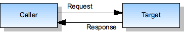
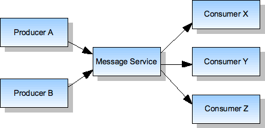
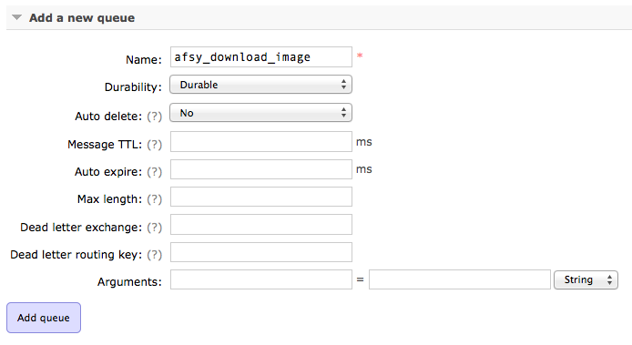
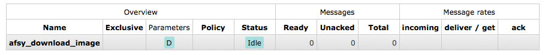
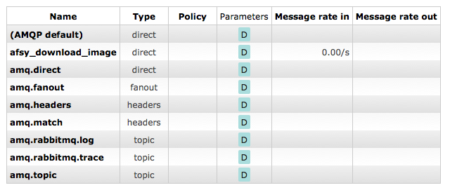
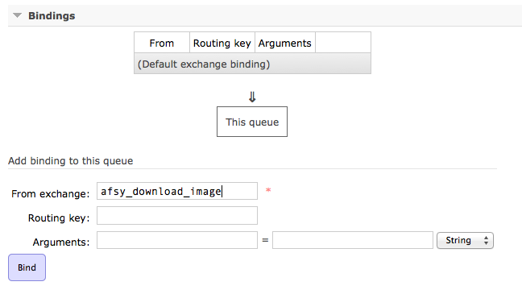
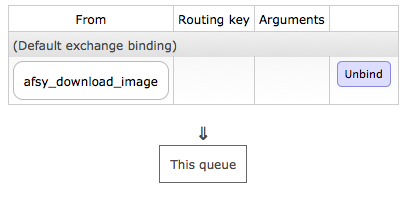
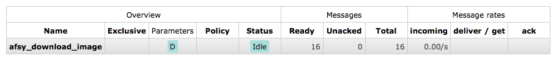

# RabbitMQ et Symfony2 : comment faire des traitements asynchrones et gérer les queues

On reproche souvent à PHP d'être un langage trop limité, notamment en ce qui concerne les traitements lourds et l'asynchronisme. Quand on a, par exemple, besoin de dérouler des actions sur un ensemble de 10 000 éléments, ça devient effectivement compliqué, et ça prend énormément de ressources serveur... sauf quand on utilise un gestionnaire de file d'attente.

Je vais donc vous présenter aujourd'hui un système de messagerie qui implémente le protocole [AMQP](http://en.wikipedia.org/wiki/Advanced_Message_Queuing_Protocol) : [RabbitMQ](http://www.rabbitmq.com/), et son bundle Symfony2 [RabbitMQBundle](https://github.com/videlalvaro/rabbitmqbundle), développé par [Alvaro Videla](https://github.com/videlalvaro).

## Un système de messagerie ?

Après avoir utilisé différentes API de différentes manières, un protocole de messagerie a été créé par la banque [JPMorgan Chase](http://fr.wikipedia.org/wiki/JPMorgan_Chase) pour plus de facilité d'échange entre les différents systèmes. Au lieu d'avoir un protocole spécifique pour chaque échange, on utilise un "service de messagerie" qui dispatche automatiquement les messages. Et au lieu de faire des échanges "directs", chaque système peut envoyer un/des message(s) au service et N systèmes peuvent s'y abonner pour récupérer les messages. 

### Producteurs, consommateurs... de quoi ?

Dans un système de messagerie, le processus pour envoyer des messages à l'agent (`broker`) est appelé un **producteur** (`producer`), alors que celui qui reçoit les messages est appelé **consommateur** (`consumer`). En fait, tout va du producteur au consommateur... comme dans la vraie vie :)

### Quelques explications en images

Ca vous semble confus ? Voici deux images pour y voir plus clair :



On a un système simple avec un appelant et un appelé, mais pas plus d'interactions.



On a un système plus complexe où, grâce au service de messagerie, un appelant B peut communiquer directement avec 3 appelés X, Y et Z. (source des images : [Inspirel](http://www.inspirel.com/yami4/book/4-1.html)).

### Producteurs, consommateurs... de quoi ?

Dans un système de messagerie, le processus pour envoyer des messages à l'agent (`broker`) est appelé un **producteur** (`producer`), alors que celui qui reçoit les messages est appelé **consommateur** (`consumer`). En fait, tout va du producteur au consommateur... comme dans la vraie vie :)

## Installation et prérequis

### Installation de RabbitMQ 

Trève de bavardages, rentrons directement dans le vif du sujet. On va tout d'abord installer [RabbitMQ](http://www.rabbitmq.com/), et je vous rassure, avant que vous ne le demandiez, il est compatible avec [Linux](http://www.rabbitmq.com/install-debian.html), [Mac](http://www.rabbitmq.com/install-standalone-mac.html) et [Windows](http://www.rabbitmq.com/install-windows.html). 

Une fois installé, il vous suffit de lancer le serveur avec la commande :

```
$ rabbitmq-server -detached
```
    
Ensuite, lancez votre navigateur préféré et rendez-vous à l'adresse [http://localhost:15672/](http://localhost:15672/) pour pouvoir voir votre système de messagerie (pour l'instant vide). Par défaut, on y accède via le compte **guest** (mot de passe `guest`), mais vous pourrez ensuite gérer différents utilisateurs. 

Ca y est, on a un système prêt à faire des traitements asynchrones.

### Création d'un bundle AfsyTutorialBundle

Pour cet exemple, nous allons créer un bundle `Afsy/Bundle/TutorialBundle` via la ligne de commande Symfony (avec XML comme format de configuration et génération de l'ensemble de la structure).

```
$ cd /path/to/afsy/project
$ php app/console generate:bundle
```

Pour des raisons de simplicité, on utilisera le format YAML pour le routing, et le XML pour les services.

On va ensuite créer les dossiers `Component` et `AMQP` (dans le dossier Component) dans le dossier `Afsy`, afin de déclarer les différents composants qu'on va développer puis utiliser :

```
$ cd /src/Afsy
$ mkdir -p Component/AMQP 
```

C'est dans ce dossier qu'on stockera, entre autres, les différents producteurs et consommateurs. 

### Installation du RabbitMQBundle

Une fois notre bundle prêt, on va ajouter le bundle RabbitMQBundle au fichier `composer.json` :

``` json
{
    "require": {
        "oldsound/rabbitmq-bundle": "1.2.*",
    }
}
```

Puis, faire un update : 

```
$ composer update oldsound/rabbitmq-bundle
```

Enfin, l'ajouter dans le fichier `app/AppKernel.php` :

``` php
public function registerBundles()
{
    $bundles = array(
        new OldSound\RabbitMqBundle\OldSoundRabbitMqBundle(),
    );
}
```

### Configuration de RabbitMQBundle

Pour configurer le bundle, rien de difficile : on utilise la [configuration par défaut du bundle](https://github.com/videlalvaro/rabbitmqbundle#usage), qu'on ajoute dans `app/config/config.yml` : 

```yaml
old_sound_rabbit_mq:
    connections:
        default:
            host:     'localhost'
            port:     5672
            user:     'guest'
            password: 'guest'
            vhost:    '/'
            lazy:     false
```

Et c'est parti, on peut l'utiliser.

## Un peu de mise en pratique

Après la théorie (et les installations), passons à la pratique. Prenons un exemple concret : un aspirateur de site, ou du moins, de page web. Pourquoi un aspirateur de site ? Parce que c'est toujours pratique de pouvoir télécharger une page depuis une application PHP, et de télécharger en même temps l'ensemble des images de cette page. 

### Un dernier prérequis 

Une dernière chose avant de commencer à développer cet aspirateur... Dans le cadre de cet exercice, nous allons utiliser Curl pour "aspirer" les différentes pages web. Mais pour se faciliter la tâche, il vaut mieux télécharger une classe Curl, un peu comme [celle-là](https://github.com/php-curl-class/php-curl-class) et la mettre dans le dossier `Afsy/Component/Curl`, plutôt que de faire les requêtes à la main. Les scripts suivants utiliseront seulement la méthode *get()* de cette classe.

On enregistre ensuite la classe en tant que service dans le fichier services.xml (`src/Afsy/Bundle/TutorialBundle/Resources/config/services.xml`)

```xml
<service id="curl" class="Afsy\Component\Curl\Curl">
</service>
```

Et c'est tout bon :)

## Un peu de mise en pratique

Après la théorie (et les installations), passons à la pratique. Prenons un exemple concret : un aspirateur de site, ou du moins, de page web. Pourquoi un aspirateur de site ? Parce que c'est toujours pratique de pouvoir télécharger une page, et de télécharger en même temps l'ensemble des images de cette page.

### Un aspirateur basique

On va donc créer une classe d'aspirateur de page assez simple, nommée `PageHoover.php` et enregistrée dans le dossier `/src/Afsy/Component/` :

```php

namespace Afsy\Component;

use Afsy\Component\Curl\Curl;
use Symfony\Component\DomCrawler\Crawler;

class PageHoover
{

    protected $curl = null;
    protected $options = array();
    protected $downloadFolder = null;

    /**
     *  Main constructor
     *  
     *  @param (Curl) $curl         Curl class
     *  @param (array) $options     Options list
     *
     *  @return (void)
     */
    public function __construct(Curl $curl, array $options)
    {
        // Initialize
        $this->curl = $curl;
        $this->options = $options;

        // Initialize options
        $this->downloadFolder = $options['downloadFolder'];
    }

    /**
     *  Download page method
     *
     *  @param (string) $page       Page to download (url)
     *
     *  @return (boolean) Download status
     */
    public function downloadPage($page)
    {
        // Initialize
        $pageParts = pathinfo($page);
        $saveFile = $this->downloadFolder.date('Ymd-His').'-'.$pageParts['filename'].'.htm';

        // Download page
        $pageContent = $this->curl->get($page); 
     
        // Check downloaded content
        if(!$pageContent) { return false; }

        // Save page in downloadFolder
        if(!file_put_contents($saveFile, "\xEF\xBB\xBF".$pageContent->body))
        {
            // Throw error
            throw new \Exception("Error saving file", 1);
        }

        // Initialize crawler
        $crawler = new Crawler($pageContent->body);

        // Get images list
        $images = $crawler->filter('img')->each(function($image, $i) { return $image->attr('src'); });

        // @todo : Download images

        // Return status
        return true;
    }
}
```

Ensuite, on l'instancie comme service dans le fichier `src/Afsy/Bundle/TutorialBundle/Resources/config/services.xml` : 

```xml
<service id="afsy.pagehoover" class="Afsy\Component\PageHoover">
    <argument type="service" id="curl" />
    <argument type="collection">
        <argument key="downloadFolder">./downloaded_pages/</argument>
    </argument>
</service>
```

On prendra soin, au passage, de créer le dossier `/web/downloaded_pages/` pour stocker les pages téléchargées, en lui mettant les bons droits (comme un dossier de cache) : 

```
$ cd web/
$ mkdir downloaded_pages
$ chmod -R 777 downloaded_pages/
```

### Création d'une première action

Dans le contrôleur par défaut (`/src/Afsy/Bundle/TutorialBundle/Controller/DefaultController.php`), on va créer une méthode `downloadAction()` :

```php
public function downloadAction()
{
    // Initialize
    $pageHoover = $this->container->get('afsy.pagehoover');

    // Download page
    $page = 'http://afsy.fr/';
    $pageHoover->downloadPage($page);

    // Return status
    $response = new Response();

    return $response->setContent('Page "'.$page.'" is downloaded !')->send();
}
```

Et, bien sûr, on créera le routing associé : 

```yaml
afsy_tutorial_download:
    pattern:    "/afsy/download"
    defaults:   { _controller: "AfsyTutorialBundle:Default:download" }
```

## Passons vraiment à l'action

Tout ça est bien beau, mais pour l'instant, c'est que du connu... Éffectivement, mais c'était requis pour pouvoir vous expliquer plus facilement le principe. Et maintenant, on va pouvoir développer la partie consacrée au téléchargement des images. Pour cela, on va d'abord créer notre premier producteur.

### Le premier producteur

Le producteur n'a besoin que de très peu d'informations : un peu de config... et c'est tout. On va donc mettre à jour la configuration du plugin pour le déclarer :

```yaml
old_sound_rabbit_mq:
    ...
    producers:
        afsy_download_image:
            connection:             default
            exchange_options:       { name: 'afsy_download_image', type: direct }
```
            
Ensuite, on pourra l'utiliser comme un autre service. On va donc mettre à jour la configuration de notre service **PageHoover**, en ajoutant ce producteur en 2ème argument : 

```xml
    <argument type="service" id="old_sound_rabbit_mq.afsy_download_image_producer" />
```

Vous noterez que le nom du service est très simple : **old_sound_rabbit_mq.[nom_du_producteur]_producer**.

Enfin, on met à jour la classe `PageHoover.php` : 

```php

// On utilise le Producer du RabbitMqBundle
use OldSound\RabbitMqBundle\RabbitMq\Producer;

// On le déclare en variable protégée
protected $downloadImageProducer = null;

// Et on met à jour le constructeur
public function __construct(Curl $curl, Producer $downloadImageProducer, array $[options)
{
    // […]
    $this->downloadImageProducer = $downloadImageProducer;
    // […]
}

// Et enfin, on met à jour la méthode downloadPage en ajoutant à la place de '// @todo : Download images' : 
// Download images
foreach ($images as $image) 
{
    // Initialize
    $image = str_replace(' ', '', $image);
    $imgExt = pathinfo($image, PATHINFO_EXTENSION);
    $hasHost = filter_var($image, FILTER_VALIDATE_URL, FILTER_FLAG_PATH_REQUIRED);

    // Check host
    if(!$hasHost) { $image = $pageParts['dirname'].$image; }

    // Check extension
    if(!in_array($imgExt, array('png', 'jpg', 'jpeg', 'gif'))){ $imgExt = 'png'; }

    // Create image to publish
    $imgToPublish = array
    (
        'url' => $image,
        'savePath' => $this->downloadFolder.pathinfo($image, PATHINFO_FILENAME).'.'.$imgExt,
        'savedHtmlFile' => $saveFile,
    );

    // Publish image
    $sImg = serialize($imgToPublish);
    $this->downloadImageProducer->publish($sImg);
}
```

Même si vous l'avez compris en lisant le code, voici quelques explications : 

- Après avoir récupéré la liste des images avec le crawler, on fait une boucle sur les urls à télécharger
- On vérifie l'extension de l'image, sinon on en met une par défaut
- On vérifie aussi que le host est bien présent, sinon on l'ajoute
- Et on crée un tableau que l'on enverra au format sérialisé au producteur

On aurait pu utiliser le JSON comme format d'échange, mais la sérialisation est le format utilisé par l'auteur du RabbitMqBundle, donc autant le suivre.

#### Pourquoi la sérialisation ?

Pour pouvoir facilement passer un objet (ici, notre image à télécharger) au consommateur qui l'utilisera de manière totalement indépendante. 
Il ne faut pas oublier que, lorsque le consommateur traitera ce message, il n'aura aucune information sur la provenance du message, 
ni ce qu'il contient ou ne contient pas. Il saura juste qu'il doit le traiter, c'est tout.

### Le premier consommateur

Il faut donc maintenant un receveur à ce tableau sérialisé, et nous allons le créer maintenant dans la classe AfsyDownloadImageConsumer dans `src/Afsy/Component/AMQP/AfsyDownloadImageConsumer.php`. Plutôt que de le faire en plusieurs étapes, nous allons faire directement le fichier en entier, avec les méthodes suivantes : 

- *__construct()* pour pouvoir initialiser curl et différentes options
- *execute()* qui est la méthode principale à implémenter
- *downloadImageTo()* une méthode de téléchargement d'une image dans un dossier

Comme suit : 

```php

namespace Afsy\Component\AMQP;

use Afsy\Component\Curl\Curl;
use OldSound\RabbitMqBundle\RabbitMq\ConsumerInterface;
use PhpAmqpLib\Message\AMQPMessage;

class AfsyDownloadImageConsumer implements ConsumerInterface
{
    /**
     * @var Curl $curl
     */
    protected $curl;

    // Folders
    protected $createFolderMod = 0755;

    /**
     *  Main constructor
     *
     *  @param (Curl) $curl                 Curl
     *  @param (array) $options             Array of options
     *
     *  @return (void)
     */
    public function __construct(Curl $curl, $options = array())
    {
        // Initialize
        $this->curl = $curl;

        // Initialize options
        $this->createFolderMod = isset($options['createFolderMod']) ? $options['createFolderMod'] : $this->createFolderMod;
    }

    /**
     *  Main execute method
     *  Execute actions for a given message
     *
     *  @param (AMQPMessage) $msg       An instance of `PhpAmqpLib\Message\AMQPMessage` with the $msg->body being the data sent over RabbitMQ.
     *
     *  @return (boolean) Execution status (true if everything's of, false if message should be re-queued)
     */
    public function execute(AMQPMessage $msg)
    {
        // Initialize
        $imageToDownload = unserialize($msg->body);

        // Download image
        if(!$this->downloadImageTo($imageToDownload['url'], $imageToDownload['savePath']))
        {
            // Image should be downloaded again
            return false;
        }

        // Update saved html file
        $savedHtmlFileContent = file_get_contents($imageToDownload['savedHtmlFile']);

        // Update images paths
        $savedHtmlFileContent = str_replace($imageToDownload['url'], $imageToDownload['savePath'], $savedHtmlFileContent);

        // Save file
        return file_put_contents($imageToDownload['savedHtmlFile'], $savedHtmlFileContent);
    }

    /**
     *  Download an image to a given path
     * 
     *  @param (string) $downloadImagePath          Download image path 
     *  @param (string) $saveImagePath              Save image path
     * 
     *  @return (boolean) Download status (or true if file already exists)
     */
    protected function downloadImageTo($downloadImagePath, $saveImagePath)
    {
        // Initialize
        $saveImageFolder = pathinfo($saveImagePath, PATHINFO_DIRNAME);
        $saveStatus = false;

        // Check if image already exists
        if(file_exists($saveImagePath)) 
        { 
            echo 'File "'.$saveImagePath.'" already exists'."\n";
            return true; 
        }
        
        // Check if folder already exists
        if(!is_dir($saveImageFolder))
        {
            // Initialize
            $createFolderMod = is_int($this->createFolderMod) ? $this->createFolderMod : intval($this->createFolderMod);

            // Create folder
            mkdir($saveImageFolder, $createFolderMod, true);
            echo 'Folder "'.$saveImageFolder.'" has been created.'."\n";
        }

        // Download image
        try 
        {
            // Log download status
            echo 'Begin download of "'.$downloadImagePath.'".'."\n";

            // Get image content 
            $imageContent = $this->curl->get($downloadImagePath);

            // Check content
            if(!$imageContent || $imageContent->headers['Status-Code'] == '404') 
            {
                throw new \Exception('Error downloading file "'.$downloadImagePath.'" : returns a void content or a 404 page.', 1);
                return false;
            }

            // Save image 
            $saveStatus = file_put_contents($saveImagePath, $imageContent);
        
            // Log info
            echo 'Image "'.$saveImagePath.'" has been successfully downloaded!'."\n";

        } 
        catch (\Exception $e) 
        {
            // Log error
            echo '#ERROR# Image "'.$downloadImagePath.'" was not downloaded! '."\n";
        }

        // Return save status
        return $saveStatus;
    }
}
```

On l'ajoute dans la liste des services disponibles : 

```xml
<service id="afsy_download_image_service" class="Afsy\Component\AMQP\AfsyDownloadImageConsumer">
    <argument type="service" id="curl" />
    <argument type="collection">
        <argument key="createFolderMod">0755</argument>
    </argument>
</service>
```

Enfin, on l'ajoute dans la configuration :  

```yaml
old_sound_rabbit_mq:
    ...
    consumers:
        afsy_download_image:
            connection:             default
            exchange_options:       { name: 'afsy_download_image', type: direct }
            queue_options:          { name: 'afsy_download_image' }
            callback:               afsy_download_image_service
```

Voilà, on a notre premier consommateur et on peut maintenant presque l'utiliser...

### Une dernière petite chose : la file d'attente

On l'a vu, RabbitMQ a une [interface web](http://localhost:15672/) et on peut y gérer les files d'attentes. 
C'est ce que nous allons faire maintenant en créant la file d'attente liée à notre consommateur. Sinon, sans file d'attente, ça ne marcherait tout simplement pas.

On va se rendre dans cette interface web, et cliquer sur l'onglet [Queues](http://localhost:15672/#/queues).
Puis, tout simplement ajouter une file d'attente comme suit : 



Une fois ajoutée, elle apparaît directement dans la liste des files d'attente :



En parallèle, RabbitMQ crée automatiquement une boite d'échanges (visible dans l'onglet [Exchanges](http://localhost:15672/#/exchanges)) avec le nom de la file d'attente :



Il ne reste plus qu'à lier la file d'attente à la boite d'échanges :



Ce qui donne : 



Et voilà !

### Et c'est parti... 

On peut maintenant retourner sur notre navigateur préféré pour actualiser la page et voir ce que ça donne.
Normalement (si vous êtes connectés à internet ^^), la page se télécharge bien et affiche le message "Page "http://afsy.fr/" is downloaded !"
 
## Le traitement des messages

Une fois la page téléchargée, on peut voir que de nouveaux messages sont arrivés dans la file d'attente `afsy_download_image` :



Il faut maintenant les traiter. Pour ça, on va utiliser la ligne de commande et lancer la commande suivante :

```
$ cd /path/to/your/project
$ php app/console rabbitmq:consumer -w -m 1 afsy_download_image
```

Les paramètres -w et -m 1 sont importants pour ce premier test : 

- `-w` permet de stopper le processus dès qu'il n'y a plus de signal UNIX
- `-m 1` permet de ne traiter que le premier message (et bien sûr on en déduit donc que `-m 15` permet de ne traiter que les 15 premiers messages)

Normalement vous devriez avoir ce type de message :


Ca y est ! On a bien téléchargé notre première image. On peut maintenant lancer le traitement de toutes les autres : 

```
$ php app/console rabbitmq:consumer -w afsy_download_image
```

C'est pas plus compliqué que ça !

## Et maintenant ?

On a vu comment lancer le téléchargement d'une page et le téléchargement des images liées à cette page... Et ça suffira pour aujourd'hui !
Avec ce petit aspirateur de site, que vous allez pouvoir améliorer, je vous ai expliqué comment lancer des traitements asynchrones de manière simple.
Maintenant, vous avez toutes les cartes en main pour pouvoir traiter plus de messages et de files d'attentes... voir même faire des file d'attentes en boucle :
par exemple, j'envoie un message à une file d'attente ; elle le traite et envoie un message à une autre file d'attente ; etc.

Voici d'ailleurs quelques pistes d'améliorations :

- ajout de cache
- ajout d'une interface web
- listing des pages téléchargées
- téléchargement des images d'une page dans un dossier spécifique
- etc.

Voilà, j'espère que cet article vous aura plu et je vous remercie de l'avoir lu jusqu'au bout. Je vais mettre les sources de ce projet sur GitHub, 
pour que vous puissiez les récupérer facilement. Et si vous avez des remarques et/ou des questions, n'hésitez surtout pas !

